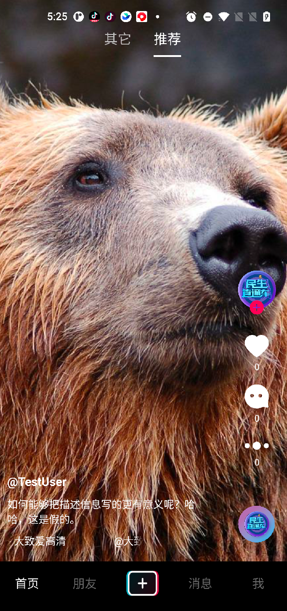
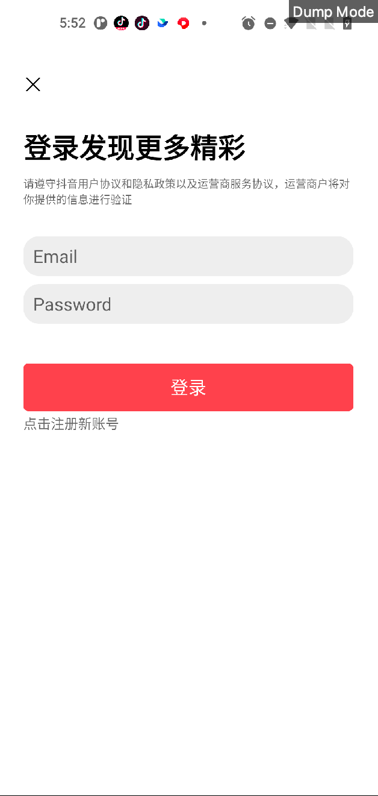
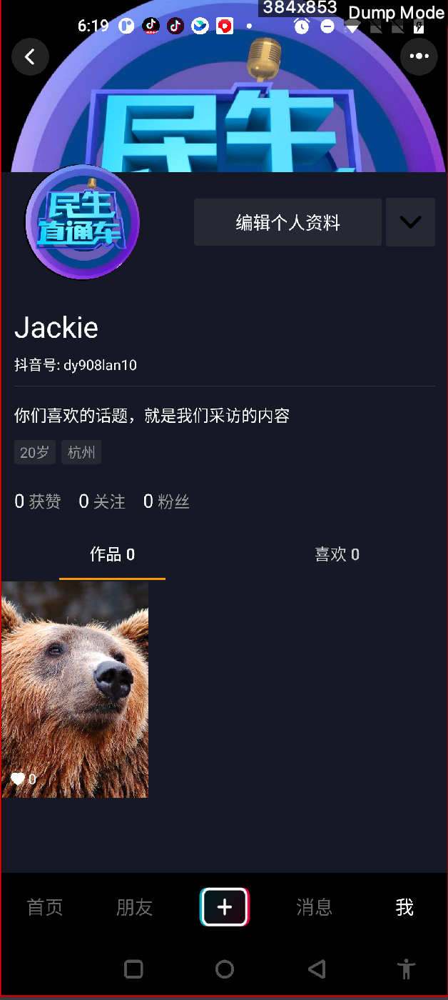
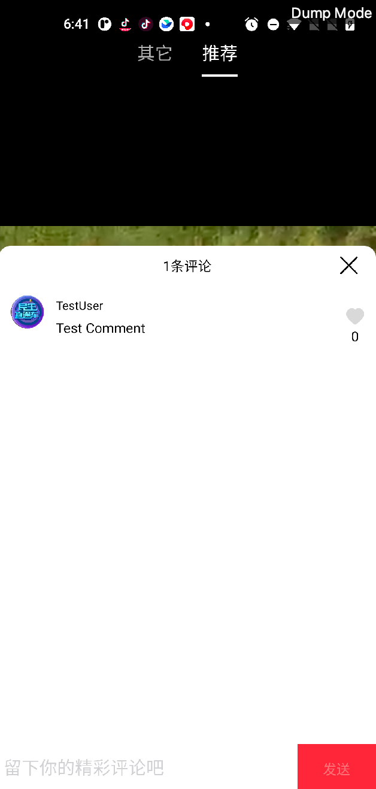
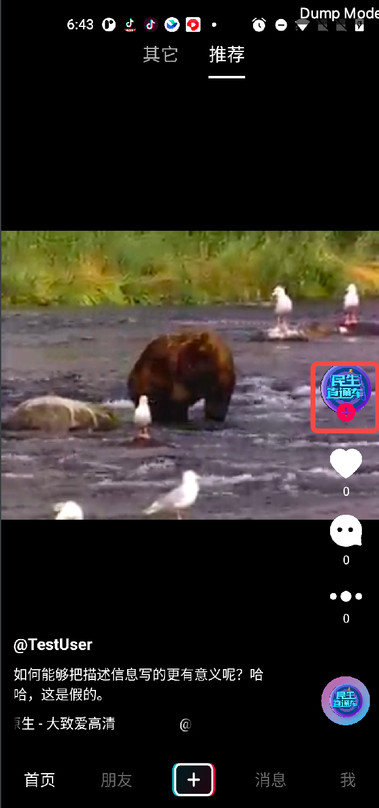
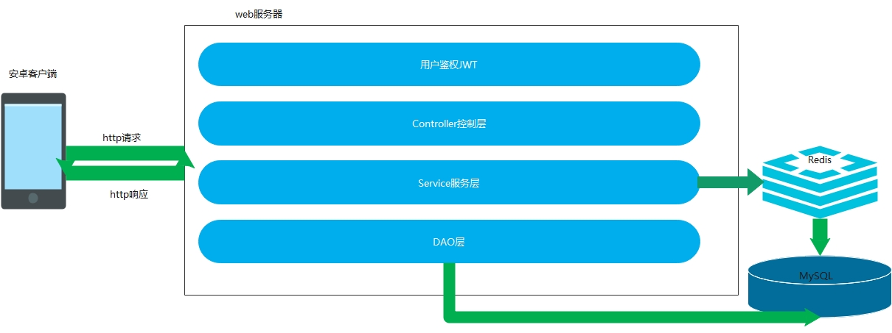
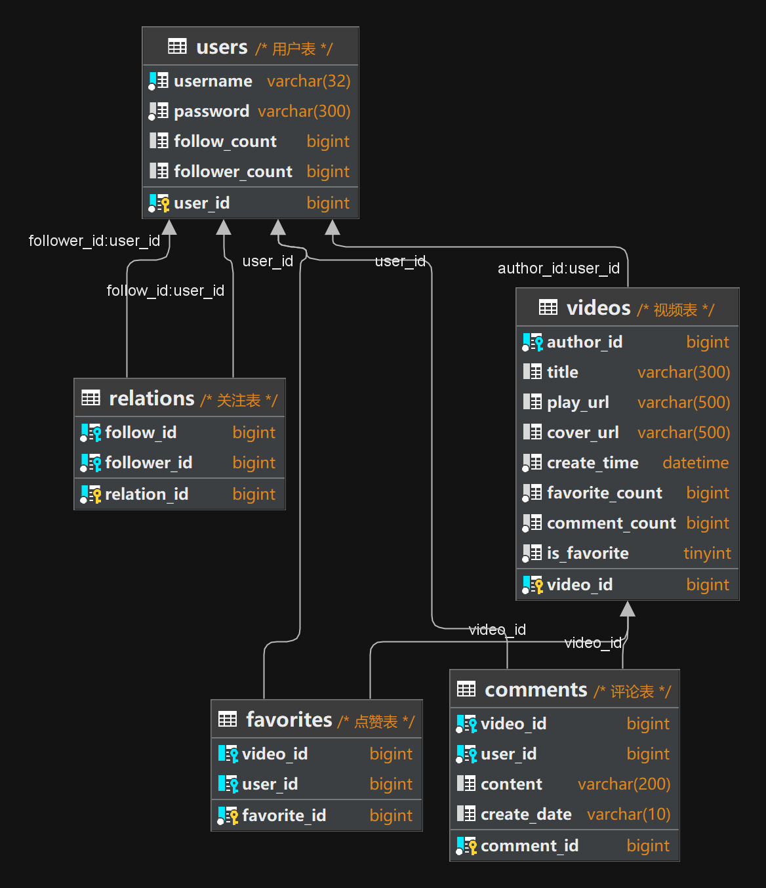

<!-- PROJECT SHIELDS -->


[](https://opensource.org/licenses/Apache-2.0)
<!-- PROJECT LOGO -->
<br />

<p align="center">
  <a href="https://github.com/xiaolihuamao/TikTok.git/">
    
  </a>

<h3 align="center">抖音简洁版</h3>
  <p align="center">
    <br />
    <a href="https://github.com/xiaolihuamao/TikTok.git"><strong>探索本项目的文档 »</strong></a>
    <br />
    <br />
  </p>
  </p>

**Attention:** We always welcome contributors to the project. Before adding your contribution, please carefully read our [Git 分支管理规范](https://ypbg9olvt2.feishu.cn/docs/doccnTMRmh7YgMwL2PgZ5moWUsd)和[注释规范](https://juejin.cn/post/7096881555246678046)。


<!-- PROJECT LOGO -->
<br />

## 目录
- [上手指南](#上手指南)
    - [开发前的配置要求](#开发前的配置要求)
    - [安装步骤](#安装步骤)
    - [演示界面](#演示界面)
    - [演示视频](#演示视频)
- [文件目录说明](#文件目录说明)
- [开发的整体设计](#开发的整体设计)
   - [整体的架构图](#整体的架构图)
   - [数据库的设计](#数据库的设计)
   - [服务模块的设计](#服务模块的设计)
     - [视频模块的设计](#视频模块的设计)
     - [点赞模块的设计](#点赞模块的设计)
     - [用户模块的设计](#用户模块的设计)
     - [评论模块的设计](#评论模块的设计)
- [性能测试](#性能测试)
- [使用到的技术](#使用到的技术)
- [未来展望](#未来展望)
  - [消息队列展望](#消息队列展望)
  - [分布式服务](#分布式服务)
  - [推荐视频展望](#推荐视频展望)
- [如何参与开源项目](#如何参与开源项目)
- [版本控制](#版本控制)
- [贡献者](#贡献者)
- [鸣谢](#鸣谢)


### 上手指南

#### 开发前的配置要求

1. go 1.19
2. MySQL(数据库sql文件在sql包中)
3. 搭建Redis环境
4. 配置ffmpeg）
5. [最新版抖音客户端软件](https://bytedance.feishu.cn/docs/doccnM9KkBAdyDhg8qaeGlIz7S7#mC5eiD)


#### 安装步骤
1. 下载源码
2. 配置SSH、Redis、静态服务器地址等相关参数
3. 启动服务
4. 在客户端配置相关地址服务端地址即可

```sh
git clone https://github.com/xiaolihuamao/TikTok.git
```
#### 演示界面
**基础功能演示**

<a href="https://github.com/xiaolihuamao/TikTok.git/">
    
    
    
    
</a>

**拓展功能演示**

<a href="https://github.com/xiaolihuamao/TikTok.git/">
    
    
</a>


#### 演示视频
[](http://43.138.25.60/tiktok.mp4)

### 文件目录说明

```
├─biz
│  ├─controller //controller层
│  ├─dao        //持久化层
│  ├─model      //持久化实体类层
│  ├─mw         //中间件层
│  │  ├─jwt     //jwt验证层
│  │  └─redis   //redis初始化层
│  ├─router     //自动生成路由
│  ├─service    //service层
│  │  ├─conf     //配置文件
│  │  ├─mysql    //再封装SQL函数
│  │  └─timeTaskService  //定时任务层
│  ├─sql          //建表语句
│  └─utils        //工具类层
├─conf           //配置文件
├─file           //静态文件资源
│  └─upload
│      └─backgrounds
└─images        //图片引用

```

### 开发的整体设计
#### 整体的架构图
<p align="center">
  <a href="https://github.com/xiaolihuamao/TikTok.git/">
    
  </a>

#### 数据库的设计
<p align="center">
  <a href="https://github.com/xiaolihuamao/TikTok.git/">
    
  </a>
</p>


#### 服务模块的设计

###### 视频模块的设计
视频模块包括视频Feed流获取、视频投稿和获取用户投稿列表。
###### 点赞模块的设计
点赞模块包括点赞视频、取消赞视频和获取点赞列表。
###### 用户模块的设计
用户与安全模块包括用户注册、用户登录和用户信息三个部分
###### 评论模块的设计
评论模块包括发表评论、删除评论和查看评论列表。


### 性能测试
通过命令 go tool pprof -http=:6060 "http://localhost:8080/debug/pprof/profile?seconds=120" 生成了两个版本的火焰图，左图为v1.0，右图为v1.2版本，通过对比两张详细火焰图，优化后的相同方法调用时间更短（添加了相应的中间件）

<p align="center">
<a href="https://github.com/HammerCloth/tiktok.git/">
    
    
</a>


### 使用到的技术
框架相关：
- [Hertz](https://www.cloudwego.io/zh/docs/hertz/)
- [Gorm](https://gorm.io/docs/)
- [Gen](https://github.com/go-gorm/gen)
  
服务器相关：
- [ffmpeg](https://ffmpeg.org/documentation.html)
中间件相关：
- [Redis](https://redis.io/docs/)
数据库：
- [MySQL](https://dev.mysql.com/doc/)

### 未来展望
  
#### 消息队列展望
使用常见的业务消息队列RocketMQ,对于项目中的某些方法调用通过注册消息，消费消息的方法，实现高并发场景下的解耦和削峰
#### 分布式服务
利用dubbogo来完成分布式，使用貔貅作为网关，Nacos作为注册中心，将不同的模块分别布置到不同的服务器上，以RPC调用的方式来调用当前模块依赖其他模块的方法，做到分布式处理与解耦。
本次项目使用了字节的开源HTTP框架Hertz，但并未引入同系列的字节开源RPC框架kitnex,未来可以进一步使用。

#### 推荐视频展望
创新推荐算法
视频推荐算法的原理一般可以分为两个方面，即基于内容的推荐和协同过滤推荐。
基于内容的推荐
基于内容的推荐算法是指根据用户过去的行为和兴趣，推荐相似类型的内容给用户。其核心思想是对视频的元素进行提取和表示，然后计算不同视频之间的相似度，最后推荐相似度高的视频给用户。
常见的基于内容的推荐算法包括：TF-IDF 算法、余弦相似度算法、聚类算法、主题模型等。
协同过滤推荐
协同过滤推荐算法是基于用户的历史行为数据，通过分析不同用户之间的相似度来推荐视频。其核心思想是通过分析用户的历史行为（如点击、浏览、评论、收藏等）来确定用户的兴趣，然后通过计算不同用户之间的相似度，推荐与用户兴趣相似的视频。

### 如何参与开源项目

贡献使开源社区成为一个学习、激励和创造的绝佳场所。你所作的任何贡献都是**非常感谢**的。

1. Fork the Project
2. Create your Feature Branch (`git checkout -b feature/AmazingFeature`)
3. Commit your Changes (`git commit -m 'Add some AmazingFeature'`)
4. Push to the Branch (`git push origin feature/AmazingFeature`)
5. Open a Pull Request

### 版本控制

该项目使用Git进行版本管理。您可以在repository参看当前可用版本。

### 贡献者
- 傅星源 https://github.com/xiaolihuamao
- 马婵媛 https://github.com/MCYhhh
- 张王骏 (https://github.com/luckyjunjunjun)
- 朱其涛 (https://github.com/baiwangjiahewang)
- 张锡洋 https://github.com/u-beep
- 张朔 https://github.com/zslqwy

*您也可以查阅仓库为该项目做出贡献的开发者。*

### 版权说明

该项目签署了Apache License2.0 授权许可,详情可参阅License文件

### 鸣谢

- [字节跳动后端青训营](https://youthcamp.bytedance.com/)

